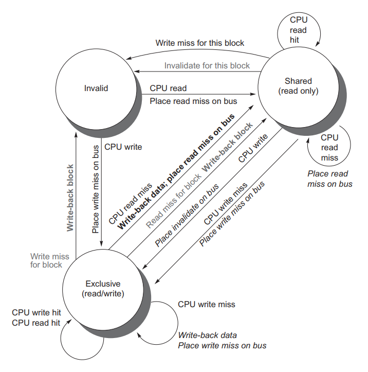
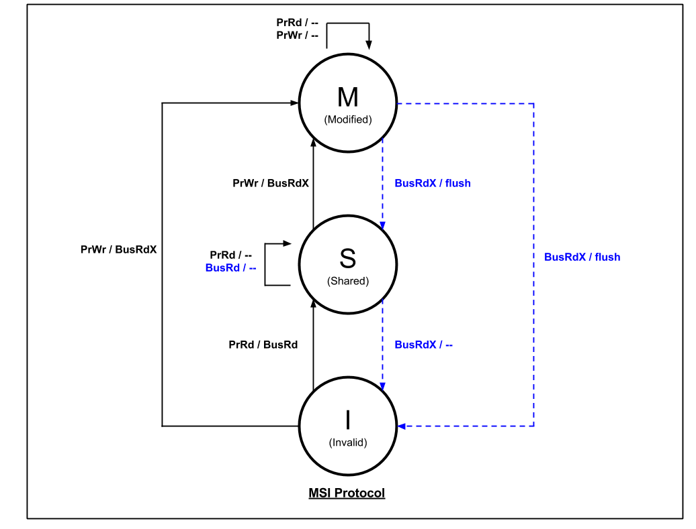
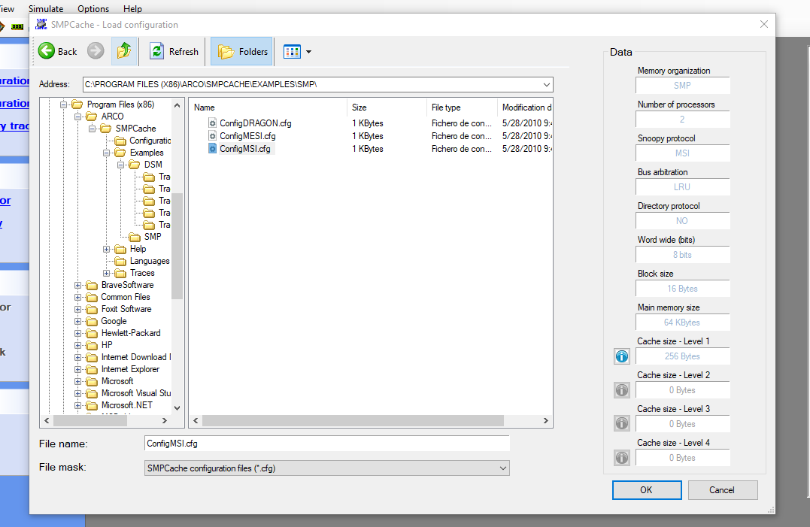
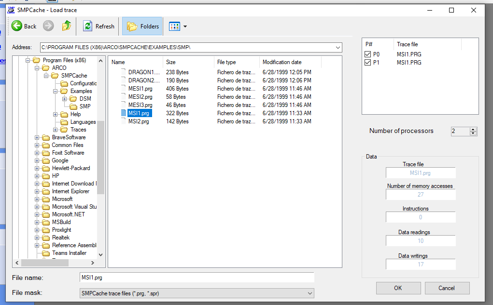
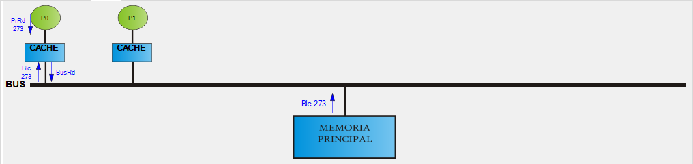
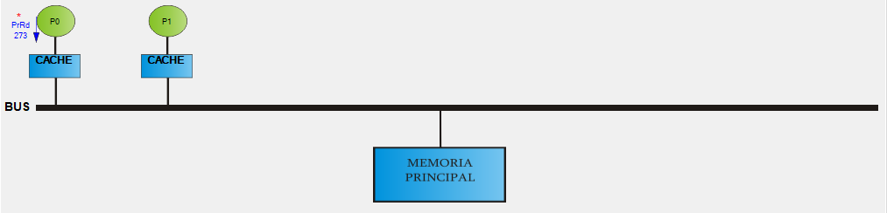

# CACHE COHERENCE SIMULATION

In this repository we are presenting the Cache Coherence MSI Protocol to analyze how would cache perform under various workloads.

We have studied about different snooping based Cache Coherence Protocols in class. Whenever a processor wants to read or write something, it tries to use its own cache to avoid having to go to the memory each time (as it’s very slow). But, when we have multiple processors, we need to synchronize the caches, so that all processors have a coherent view of memory. For this, one approach is to use a snooping cache, where each cache monitors the memory reads and writes done by other caches and takes some action based on those requests. MSI is one simple choice but there are other protocols too which offer different kinds of benefits under specific workloads - MESI, MOSI, MOESI, etc. 

To simulate the output we are using SMPCache simulator which comes with a pre-configured memory traces and different protocols configurations to be used for the simulation.

#### <ins>The following is the **State Transition Diagram** for MSI Protocol:</ins>



**<ins>The basic MSI protocol with the Modified, Shared and Invalid states.</ins>**



## Simulator Configuration

1. Open SMPCache simulator and choose `Load Configuration` from **file** menu.
2. On the opened window go to the following path `C:\PROGRAM FILES (X86)\ARCO\SMPCACHE\EXAMPLES\SMP\` and choose `ConfigMSI.cfg` to load the MSI protocol pre-configured files.



as seen on the right of this picture, this config contains 2 processes and cache of size 256 Bytes each with a block size of 16 Bytes.

3. Now from **file** menu choose `Open memory traces` and go to this path`C:\PROGRAM FILES (X86)\ARCO\SMPCACHE\EXAMPLES\SMP\` then on top right corner load P0 and P1 with `MSI1.prg`.



4. Now your program is ready for simulation and from **View**  menu choose `Cache Evolution` and make sure `Processor cache is 0`

## Simulation Results

> **Accesses number: 1**



```
Node P[0] Seek block -> 273
	1.- Reading request (PrRd)
	2.- Miss in cache
	3.- Bus reading request (BusRd)
	4.- The bus arbiter grants bus to node P0
	5.- Transfer of block 273 from main memory
```

**State Transition In Cache:**

```
INVALID ---> SHARED
```

>  **Accesses number: 2, 3, 4, 5**



```
Node P[0] Seek block -> 273
	1.- Reading request (PrRd)
	2.- Hit in cache
```

**State Transition In Cache:**

```
SHARED ---> SHARED
```

------

> **Accesses number: 6**

 

 ```
Node P[0] Seek block -> 273
	1.- Writing request (PrWr)
	2.- Hit in cache
	3.- Bus exclusive reading request (BusRdX)
	4.- The bus arbiter grants bus to node P0
	5.- Transfer of block 273 from main memory
 ```

**State Transition In Cache:**

 

``` 
SHARED ---> MODIFIED
```

------

> **Accesses number: 7**

 

```
Node P[0] Seek block -> 273
	1.- Writing request (PrWr)
	2.- Hit in cache
```

**State Transition In Cache:**


``` 
MODIFIED ---> MODIFIED

MODIFIED ---> INVAILD
```

------

> **Accesses number: 8**

 

```
Node P[1] Seek block -> 273
	1.- Writing request (PrWr)
	2.- Miss in cache
	3.- Bus exclusive reading request (BusRdX)
	4.- The bus arbiter grants bus to node P0
	5.- Transfer of block 273 from node P1
```

**State Transition In Cache:**

 

```
INVAILD ---> MODIFIED
```

------

> **Accesses number: 9** 

 

```
Node P[0] Seek block -> 273
	1.- Writing request (PrWr)
	2.- Hit in cache 
```

**State Transition In Cache:**


```
MODIFIED ---> MODIFIED

MODIFIED ---> INVAILD
```

------

> **Accesses number: 10**

 

```
Node P[1] Seek block -> 273
	1.- Writing request (PrWr)
	2.- Miss in cache
	3.- Bus exclusive reading request (BusRdX)
	4.- The bus arbiter grants bus to node P0
	5.- Transfer of block 273 from node P1
```

**State Transition In Cache:**

 

```
INVAILD ---> MODIFIED
```


------

> Accesses number: 11


```
Node P[0] Seek block -> 273
	1.- Reading request (PrRd)
	2.- Hit in cache
```

**State Transition In Cache:**


```
MODIFIED ---> MODIFIED

MODIFIED ---> INVAILD
```

------

> **Accesses number: 12**


```
Node P[0] Seek block -> 273
	1.- Reading request (PrRd)
	2.- Miss in cache
	3.- Bus reading request (BusRd)
	4.- The bus arbiter grants bus to node P0
	5.- Transfer of block 273 from node P1
	6.- Writeback in node P1 block 273
		6a.- Writeback request (BusWb)
		6b.- Transfer of block 273 to main memory
```

**State Transition In Cache:**


```
INVAILD ---> SHARED
```

------

> **Accesses number: 13**


```
Node P[0] Seek block -> 273
	1.- Reading request (PrRd)
	2.- Hit in cache
```

**State Transition In Cache:**


```
SHARED ---> SHARED
```

------

> **Accesses number: 14**


```
Node P[0] Seek block -> 273
	1.- Reading request (PrRd)
	2.- Hit in cache
```

**State Transition In Cache:**


```
SHARED ---> SHARED
```

------

> **Accesses number: 15**


```
Node P[0] Seek block -> 273
	1.- Reading request (PrRd)
	2.- Hit in cache
```

**State Transition In Cache:**


```
SHARED ---> SHARED
```

---

> **Accesses number: 16**


```
Node P[0] Seek block -> 546
	1.- Writing request (PrWr)
	2.- Miss in cache
	3.- Bus exclusive reading request (BusRdX)
	4.- The bus arbiter grants bus to node P0
	5.- Transfer of block 546 from main memory
```

**State Transition In Cache:**


```
INVAILD ---> MODIFIED
```

***
> **Accesses number: 17**


```
Node P[0] Seek block -> 546
	1.- Writing request (PrWr)
	2.- Hit in cache
```

**State Transition In Cache:**

```
P[0] : MODIFIED ---> MODIFIED
P[1] : MODIFIED ---> INVALID
```
***

> **Accesses number: 18**


```
Node P[1] Seek block -> 546
	1.- Writing request (PrWr)
	2.- Miss in cache
	3.- Bus exclusive reading request (BusRdX)
	4.- The bus arbiter grants bus to node P1
	5.- Transfer of block 546 from node P0
```

**State Transition In Cache:**

```
P[1] : INVALID ---> MODIFIED
```

***

> **Accesses number: 19**


```
Node P[0] Seek block -> 546
	1.- Writing request (PrWr)
	2.- Hit in cache
```

**State Transition In Cache:**

```
P[0] : MODIFIED ---> MODIFIED 
P[1] : MODIFIED ---> INVALID
```

***

> **Accesses number: 20**


```
Node P[1] Seek block -> 546
	1.- Writing request (PrWr)
	2.- Miss in cache
	3.- Bus exclusive reading request (BusRdX)
	4.- The bus arbiter grants bus to node P1
	5.- Transfer of block 546 from node P0
```

**State Transition In Cache:**

```
P[1] : INVALID ---> MODIFIED
```
***

> **Accesses number: 21**


```
Node P[0] Seek block -> 819
	1.- Writing request (PrWr)
	2.- Miss in cache
	3.- Bus exclusive reading request (BusRdX)
	4.- The bus arbiter grants bus to node P0
	5.- Transfer of block 819 from main memory
```

**State Transition In Cache:**

```
P[0] : INVALID ---> MODIFIED
P[1] : MODIFIED ---> INVALID
```
***

> **Accesses number: 22**


```
Node P[0] Seek block -> 1092
	1.- Writing request (PrWr)
	2.- Miss in cache
	3.- Bus exclusive reading request (BusRdX)
	4.- The bus arbiter grants bus to node P0
	5.- Transfer of block 1092 from main memory
```

**State Transition In Cache:**

```
P[0] : INVALID ---> MODIFIED
P[1] : MODIFIED ---> INVALID
```
***

> **Accesses number: 23**


```
Node P[0] Seek block -> 1365
	1.- Writing request (PrWr)
	2.- Miss in cache
	3.- Bus exclusive reading request (BusRdX)
	4.- The bus arbiter grants bus to node P0
	5.- Transfer of block 1365 from main memory
```

**State Transition In Cache:**

```
INVALID ---> MODIFIED
MODIFIED ---> INVALID
```
***

> **Accesses number: 24**


```
Node P[0] Seek block -> 1638
	1.- Writing request (PrWr)
	2.- Miss in cache
	3.- Bus exclusive reading request (BusRdX)
	4.- The bus arbiter grants bus to node P0
	5.- Transfer of block 1638 from main memory
```

**State Transition In Cache:**

```
INVALID ---> MODIFIED
MODIFIED ---> INVALID
```
***

> **Accesses number: 25**


```
Node P[0] Seek block -> 1911
	1.- Writing request (PrWr)
	2.- Miss in cache
	3.- Bus exclusive reading request (BusRdX)
	4.- The bus arbiter grants bus to node P0
	5.- Transfer of block 1911 from main memory
```

**State Transition In Cache:**

```
INVALID ---> MODIFIED
MODIFIED ---> INVALID
```
***

> **Accesses number: 26**


```
Node P[0] Seek block -> 2184
	1.- Writing request (PrWr)
	2.- Miss in cache
	3.- Bus exclusive reading request (BusRdX)
	4.- The bus arbiter grants bus to node P0
	5.- Transfer of block 2184 from main memory
```

**State Transition In Cache:**

```
INVALID ---> MODIFIED
MODIFIED ---> INVALID
```
***

> **Accesses number: 27**


```
Node P[0] Seek block -> 2457
	1.- Writing request (PrWr)
	2.- Miss in cache
	3.- Bus exclusive reading request (BusRdX)
	4.- The bus arbiter grants bus to node P0
	5.- Transfer of block 2457 from main memory
```

**State Transition In Cache:**

```
INVALID ---> MODIFIED
MODIFIED ---> INVALID
```
